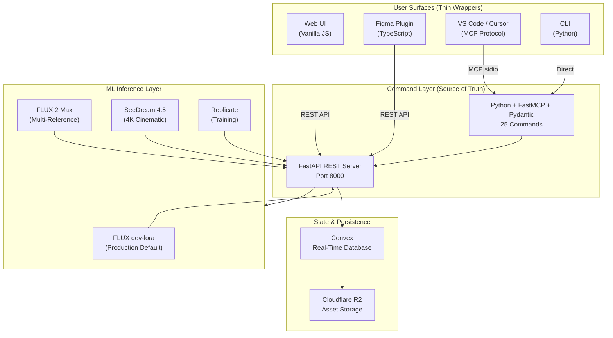
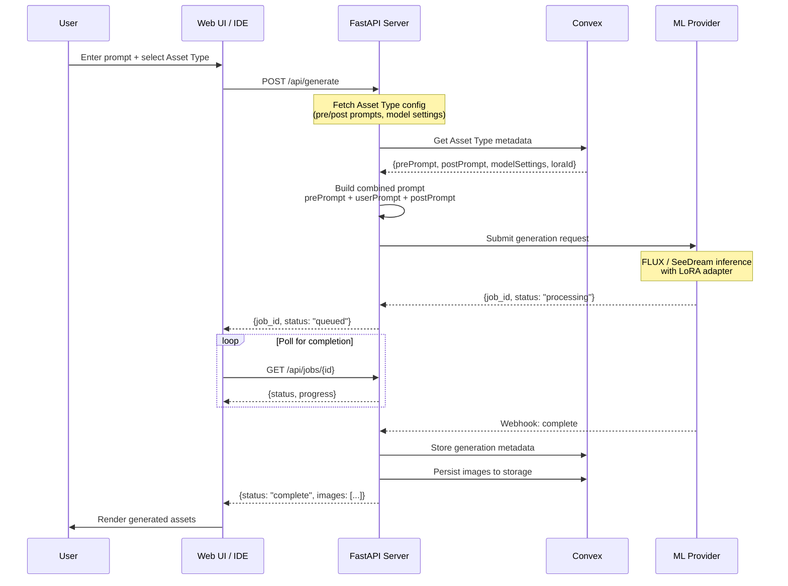
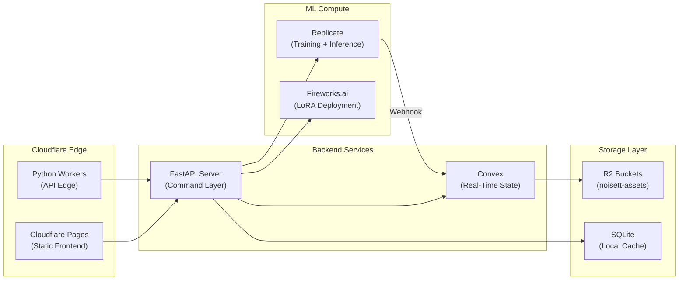
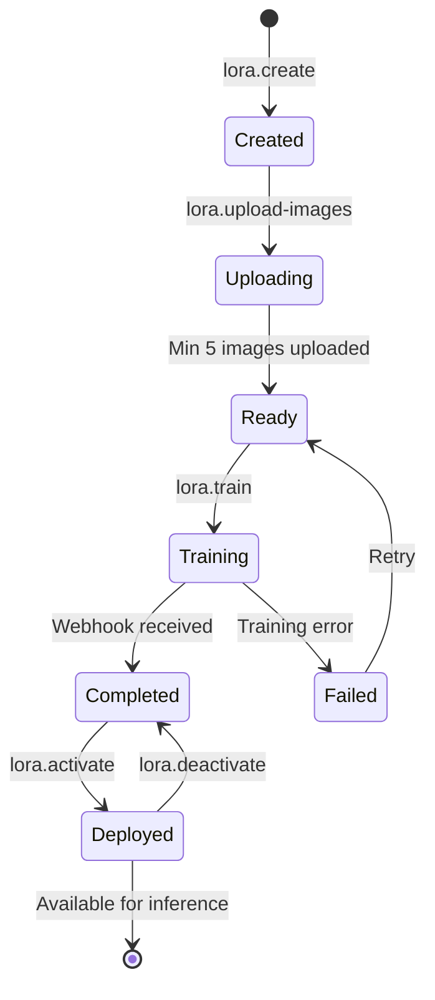

# Fabric UX Designer — Executive Brief

> **Product**: Fabric UX Designer (internal codename: *Noisett*)  
> **Category**: AI-Powered Brand Asset Generation Platform  
> **Status**: Production Ready | v1.0.0-dev  
> **Architecture**: Agent-First Development (AFD) — **100% Compliant** ✅

---

## Executive Summary

**Fabric UX Designer** is an internal AI image generation platform purpose-built for creating on-brand visual assets at scale. It transforms text prompts into brand-aligned illustrations, icons, logos, and premium marketing imagery—ensuring creative consistency across all touchpoints.

### Key Value Propositions

| Benefit | Description |
|---------|-------------|
| **Brand Consistency** | Director-governed prompts and LoRA adapters ensure every asset adheres to brand guidelines |
| **Multi-Surface Access** | Generate from IDE (MCP), Web UI, Figma Plugin, or CLI—same commands, same results |
| **Zero-Config for Users** | Technical parameters (resolution, quality, model settings) are pre-configured by Directors |
| **Scalable Training** | Custom LoRA adapters for brand-specific styles with visual training pipelines |

---

## Platform Capabilities

### Core Features

1. **Text-to-Image Generation**
   - Generate brand-aligned images from natural language prompts
   - Support for 4 asset types: Icons, Product Illustrations, Logos, Premium Marketing
   - Pre/post prompt wrappers ensure brand consistency

2. **Custom Style Training (LoRA)**
   - Upload reference images to train brand-specific adapters
   - Real-time training progress via SSE webhooks
   - Deploy trained styles for immediate use

3. **Quality Pipeline**
   - Refinement passes (img2img enhancement)
   - 2x/4x upscaling for high-resolution outputs
   - Variation generation from source images

4. **History & Favorites**
   - Persistent generation history across devices
   - Curated favorites gallery for approved assets
   - Quick regeneration from historical prompts

---

## System Architecture



---

## Image Generation Pipeline

The following diagram illustrates the complete flow from user prompt to rendered asset:



---

## Infrastructure Architecture



---

## LoRA Training Pipeline



### Training Workflow

| Step | Command | Description |
|------|---------|-------------|
| 1 | `lora.create` | Initialize training project with name and trigger word |
| 2 | `lora.upload-images` | Upload 5-30 reference images with captions |
| 3 | `lora.train` | Submit to Replicate fast-flux-trainer |
| 4 | `lora.status` | Monitor training progress (or webhook) |
| 5 | `lora.activate` | Deploy adapter for production inference |

---

## User Interface Modes

### Director Mode (Admin)

Directors configure the creative guardrails:
- Define **Asset Types** with pre/post prompt wrappers
- Bind **LoRA adapters** to asset types for consistent styling
- Configure **model settings** (resolution, quality, steps)
- Manage **training pipelines** for new brand styles

### User Mode (End User)

End users experience a simplified "Zen" interface:
- Select an **Asset Type** (Icons, Product, Logo, Premium)
- Enter a **subject description** only
- Technical parameters are invisible—governed by Director config
- Browse **history** and mark **favorites**

---

## Technology Stack

| Layer | Technology | Purpose |
|-------|------------|---------|
| **Commands** | Python + Pydantic | Schema validation, business logic |
| **MCP Server** | FastMCP | VS Code/Cursor agent integration |
| **REST API** | FastAPI | Web UI and plugin access |
| **Real-Time State** | Convex | Persistent storage, subscriptions |
| **Edge Compute** | Cloudflare Workers | API distribution |
| **Static Hosting** | Cloudflare Pages | Web UI delivery |
| **ML Inference** | Replicate, Fireworks.ai | FLUX, SeeDream models |
| **Asset Storage** | Cloudflare R2 | Image persistence |

---

## Model Selection Guide

| Model | Best For | Cost/Image |
|-------|----------|------------|
| **FLUX dev-lora** | Production default, LoRA compatibility | ~$0.005 |
| **FLUX.2 Max** | Multi-reference character consistency | ~$0.35 |
| **SeeDream 4.5** | 4K cinematic brand imagery | Variable |
| **HiDream-I1** | High-fidelity (deprecated) | ~$0.011 |

---

## Deployment & Operations

### Live Environment

| Resource | Value |
|----------|-------|
| **Production URL** | https://noisett.thankfulplant-c547bdac.eastus.azurecontainerapps.io/ |
| **Container Platform** | Azure Container Apps (East US) |
| **Container Registry** | noisettacr.azurecr.io |
| **CI/CD** | GitHub Actions → Azure Deploy |

### Local Development

```bash
# Start all services (Convex + Python API)
npm run dev

# Access points
# Web UI:     http://localhost:8000
# API Docs:   http://localhost:8000/docs
# Convex:     https://[deployment].convex.site
```

---

## Command Reference (API)

### Generation Commands

| Command | Description | Mutation |
|---------|-------------|----------|
| `asset.generate` | Generate images from prompt | Yes |
| `asset.types` | List available asset types | No |
| `job.status` | Get generation status | No |
| `job.cancel` | Cancel running job | Yes |
| `model.list` | List available models | No |

### LoRA Training Commands

| Command | Description | Mutation |
|---------|-------------|----------|
| `lora.create` | Create training project | Yes |
| `lora.upload-images` | Upload training data | Yes |
| `lora.train` | Start training job | Yes |
| `lora.status` | Check training progress | No |
| `lora.activate` | Deploy for inference | Yes |

### History & Favorites

| Command | Description | Mutation |
|---------|-------------|----------|
| `history.list` | View generation history | No |
| `favorites.add` | Bookmark a generation | Yes |
| `favorites.list` | View bookmarked items | No |

---

## Design Philosophy

### "The Honesty Check"

> *"If it can't be done via CLI, the architecture is wrong."*

Every capability in Fabric UX Designer exists first as a validated CLI command. UI surfaces are thin wrappers that call these commands—ensuring:

- **Consistency**: Same behavior across all interfaces
- **Testability**: Commands are unit-testable in isolation
- **Agent-Friendly**: AI agents can operate via MCP without UI

### Industrial Zen Aesthetic

The UI follows a high-density, minimalist design language:
- **Dark Charcoal** base (#0d0d0d)
- **Coral/Salmon** accent (#e85d4c)
- **10px standardized spacing**
- **4px border radius**
- **Zero visual clutter**—no redundant labels

---

## Security & Compliance

| Aspect | Implementation |
|--------|----------------|
| **Authentication** | Microsoft Entra ID (JWT) |
| **Authorization** | Director role via persistent token |
| **API Security** | Webhook signature validation |
| **Data Persistence** | Convex encryption at rest |
| **Asset Isolation** | Per-project R2 buckets |

---

## Roadmap Highlights

- [x] Core generation pipeline (FLUX, SeeDream)
- [x] LoRA training integration
- [x] Figma plugin (v2)
- [x] Director Mode governance
- [x] History & Favorites persistence
- [ ] GPU quota for dedicated inference
- [ ] MCP discovery in VS Code marketplace
- [ ] Multi-LoRA composition

---

## Support & Documentation

| Resource | Location |
|----------|----------|
| **Agent Context** | [AGENTS.md](../../AGENTS.md) |
| **API Contracts** | [docs/api-contracts.md](../api-contracts.md) |
| **Strategy Docs** | [Docs/Strategy/](../../Docs/Strategy/) |
| **Changelog** | [CHANGELOG.md](../../CHANGELOG.md) |

---

*Document generated January 2026. Fabric UX Designer is 100% AFD-compliant and production-ready.*
